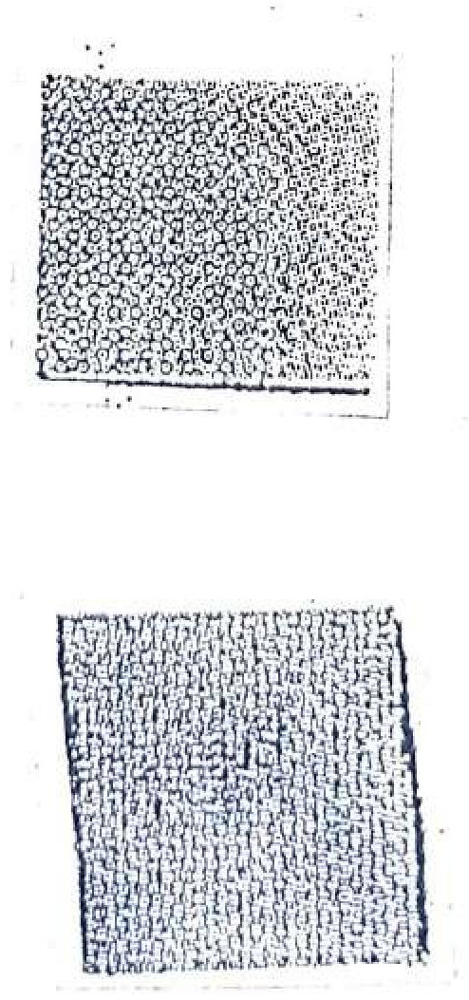

##### ADVERTENCIA

En un crescendo agobiante que pasa inadvertido en el tráfago cotidiano. Un muro entre sus ansias y el amor. Puede decirse que recién allí comienza a soportar estoicamente la necesidad de abrir. Tiránica sólo quiere reinar. ¿Parece que no saben que ella se pelea de vez en cuando? ¿Creen que no sé que los democratacristianos están histéricos con mi culo? Ella está muy crecida para eso haría mejor en no meterse con los hombres casados. O triunfa o se hunde ella misma pero siempre va acompañada de fastidios. Con la firme resolución de decirle algunas palabras sobre el asunto. ¿Parece que no saben que a mi también me tienen histérica los demócratacristianos?  

- A. LUZ. Singular esta primera en castellano de un problema eludido hasta la fecha y cuya solución lógica pone en aprieto a los cánones éticos que la sociedad... ¿Parece que no saben que las tipiquísimas quieren que les chupen el culo con furúnculo? ¿Estoy pensando que no tienen escrúpulos los demócratacristianos porque se van a poner cachúos cuando se les ponga la nariz ganchudísima?

- B. ESPACIO. ¿Parece que no saben que puede filmarse en un hotelito? Un hogar. ¿Estoy pensando que puede ser un hotel de tipiquísimas? Están tambaléandose los simientos. ¿Parece que no saben que los parroquianos que son comunistoides se están poniendo cachudísimos? ¿Parece que no saben que es porque se convierten a Diosito? Y surge el drama. En un desesperado y desgarrador esfuerzo por liberarse y presa del resentimiento emanado de una existencia a la cual todo hasta el amor filial niega una razón de ser. El procedimiento no puede ser pues el de rutina no es la aplicación de la moral social del momento. En el balance se encuentra la sonrisa de un niño ante la vida que recomienza y el amor que no fue interrumpido jamás. Aún perdura el recuerdo de lo que fue. Personal. Y no son pocos los padres que continúan preguntándose al recordar si sus propios hijos están realmente exentos del trágico destino. Ternura melancolía adolescencia nacimiento a la vida y al amor de una muchacha convulsionada estremecida humanamente. ¿Parece que no saben que son comunistitas las tipiquísimas? La rebelión la extraña guerra la victoria final. Una verdadera conmoción en la literatura cinematrográfica relata la existencia también común de la influencia nacional-socialista. Residentes en el país y en el extranjero. Deberán ser presentados centrados en la importancia de la formación valórica y el cultivo de las virtudes en el desarrollo personal. La universidad el mercado conflictos ambientales. Económica y social. Relaciones internacionales. El teléfono el fax el taller de Plástica el talle de literatura y Poesía. Consejo de Rectores. Lo que resulta más polémico es si toda la universidad debe hacer investigación aparte de docencia. Invita a mirar la experiencia internacional.

- C. PUBLICO. Agilizan su aspiración claramente expuesta. Pero la decisión de donde detenerse en la búsqueda de claridad es una decisión personal. El ejemplo paradigmático. También se interesa por las diferentes diferencias. Su lugar no está con Aristóteles ni con Dante en teoría política y mucho menos con Nietzche. Sus observaciones sirven para sí mismas a cualquier teoría moderna del Estado pero no pertenecen a ninguna. La historia de su influencia es meramente la historia de los diversos modos en que se le ha malentendido. Le preocupa constantemente en relación con qué se puede obtener la libertad. Sólo después de la lenta absorción y el impacto ambiental en la mente los repetidos contrastes entre una honestidad (la distorsión) y los engaños las deshonestidades y las tergiversaciones de la mente humana en general los seres humanos para aceptarlo tienen que disponerlo contra sus propias costumbres. Un fanático que se ha esforzado por suplir la creencia religiosa por la creencia en la humanidad. El pensamiento liberal y la civilización de Inglaterra ciertamente no recibimos la impresión ni de estar ante una gran alma ni ante un intelecto demoníaco sino meramente ante un observador modesto y honesto que apunta los hechos como son y hace comentarios tan verdaderos que parecen simples su por la unidad la paz y la prosperidad de su país. Aparte de su diferencia de método es un espíritu mucho más puro e intenso desata las más violentas respuestas apenas se le trata de deformar su doctrina que asegura su toleración por la posteridad sin el añadido de la Grecia sobrehumana. La mujer la pareja y el paisaje constituyen su veta temática. Prevé la definitiva reordenación del espacio.

##### RETRATO SÍQUICO DE UNA TIPIQUÍSIMA HACIENDO UN CAHUINCÍSIMO

“¿Parece que no saben que me tienen histérica los comunistoides? ¿Me están diciendo que es para que les cresca su pichula? ¿Están contentos porque estoy calentándome? ¿Les estoy diciendo que estoy histérica porque me metan el dedito? Ellos también se están calentando por eso que están echándose aceite? Estoy pensando que estos comunistoides son desubicaditos? ¿Me están diciendo que tengo que montarme en su cabezoida? Me están diciendo que quieren contemplármelo?”

##### RETRATO SÍQUICO DE UNA TIPIQUÍSIMA UNIVERSITARIA

“Me están diciendo que los democratacristianos son superiores legítimos? ¿Me están diciendo que me tienen que tener sometidísima? ¿Estoy pensando que los demócratacristianos me tienen histérica? ¿Me están diciendo que nos quieren convertir en excelentísimos? ¿Estoy pensando que con esto estoy asustándome? ¿Estoy pensando que pueden ponernos muchas exigencias? ¿Estoy pensando que estoy calentándome porque son increíbles para hacer cahuincitos? Me están diciendo que yo soy privilegiadísima porque soy secretarìa de un profesorcísimo. ¿Me están diciendo que estoy anquilosada como secretaria? ¿Me están diciendo que los demócratacristianos están enternecidos porque soy mujercilla? ¿Me están diciendo que no son culpables los demócratacristianos? ¿Estoy pensando que me estoy sintiendo protegidísima? //...\[¿Parece que no saben que con esto se pueden hacer diálogos?]...// ¿Estoy pensando que con los demoncitos yo me estoy sintiendo mujer? ¿Me están diciendo que los demócratacristianos son los hermanísimos de los príncipes? ¿Estoy pensando que con esto me estoy sintiendo protegidísima? ¿Estoy pensando que me estoy sintiendo protegidísima porque no pueden ser comunistoides? Estoy pensando que son los hermanos de los príncipes por eso me estoy sintiendo protegidísima. ¿Me están diciendo que los que hacen cahuines con los príncipes también son demócrata cristianos? Estoy pensando que los hijos de los príncipes son los masónicos. ¿Estoy pensando que por eso me quieren pescar como conejísimos? ¿Estoy pensando que con esto yo me estoy asustando? Me están diciendo que si me estoy asustando será mejor que no sea secretaria. Me están diciendo que parezco arrancadísima si tengo ensombrecido el rostrísimo. Me están diciendo que los hijos de los príncipes son los hijos de los comunistísimos. ¿Me están diciendo que los comunistísimos se transforman en príncipes? ¿Estoy pensando que me estoy sintiendo estúpida? ¿Estoy pensando que con esto yo estoy histérica? ¿Estoy pensando que estoy histérica porque los estudiantes universitarios son misógenos? Estoy pensando que son misógenos porque tienen sífilis. ¿Estoy pensando que con los estudiantes hay que tener escrúpulos? ¿Estoy pensando que los estudiantes universitarios son estudiantísimos? ¿Estoy pensando que las tipiquísimas se los están pescando con alucinǵenos? Estoy pensando que son las tipiquísimas que trabajan como secretarias en la Escuela de Medicina. Estoy pensando que son las de Bioquímica. ¿Estoy pensando que yo también quiero que me pesquen con alucinógenos? ¿Estoy pensando que quiero hacer un cahuincio con los estudiantes de Medicina?”

##### ¿PARECE QUE NO SABEN QUE YO NO SOY UN CONEJITO?

¿Parece que no saben que no se transforman en conejitos las caricaturas? ¿Parece que no saben que yo soy el que inventó los cohetes de emergencia para helicópteros? ¿Parece que no saben que los conejitos son los que se hacen los longillos? ¿Parece que no saben que yo me crié como señorita católica? ¿Parece que no saben que los conejos no siguen su ejemplo?

##### ¿PARECE QUE NO SABEN QUE ME TIENEN HISTERICO LOS DIALOGOS?

TIPIQUISIMA (Un comunistito le baja los calzones.) «¿Parece que no saben que tengo estrecha mi vagina?»

Comunistito (Un comunistito le está metiendo un dedito en el ombligo.) «¿Estoy pensando que estoy chupándote? ¿Estoy pensando que estoy paranoico con este cahuincito?»

TIPIQUISIMA (Un comunistito le está metiendo la pichula.) «¿Estoy pensando que con esto estoy histérica?»

COMUNISTITO (El público está escuchando lo que está pensando) “¿Te tengo histérica porque te estoy pescando cartulísima? ¿Estoy sintiéndote como se te rompen los clítoris? ¿Te tengo histérica porque me estoy culiando una longísima? ¿Te estoy sintiendo que estas sintiendo (SIC) orgasmísimo? Te estoy sintiendo que te tiene histérica la pichula. Te estoy diciendo que me des un besísimo.” 

TIPIQUISIMA (El otro comunistito está enternecido con su culísimo. Se lo está acariciando con el dedito está sintiendo como está recogiéndose. Piensa “¿Estoy pensando que estoy desviándote la pichula?”) «¿Estoy pensando que estoy histérica?»

COMUNISTITO (Es como caballo chúcaro con la tipiquísima. La tipiquísima le está dando palmacitos. El otro comunistito está dándole un besísimo.) «Tú no sabes que estás quedando embarazada.»

TIPIQUISIMA (Se lo está chupando al otro que tiene su pichula con alcohol.) «¿Estoy pensando que estoy histérica con el sonido estereofónico? Estoy pensando que los españoles son los catecúmenos. ¿Estoy pensando que los comunistitos me están diciendo que soy Carmen?»

##### ¿PARECE QUE NO SABEN QUE ESTOY HISTERICO CON LOS DEMOCRATACRISTIANOS DEL PARLAMENTO?

SECRETARIO DE LA DC. (Está sentado en su escritorio recibiendo un mensaje telefónico.) «¿Parece que no sabe que con eso me está diciendo que parezco un misionero? ¿Parece que no sabe que por teléfono no se pueden decir garabatillos?»

COMUNISTERITO (Solamente se está escuchando el auricular del teléfono.) ϟϟEstoy pensando que tú crees que los comunistas somos imbéciles. Estoy pensando que es la aplicación planificada para que todas las personas participen colectivamente de la violencia como conición 'sine ecuánon'.ϟϟ

SECRETARIO DEL DC. (Enciende un cigarro con un encededor de pedestal que parece una tipiquísima.) «Tú te creíste que yo soy un periodistito? ¿Parece que tú no sabes que estás en la dimensión desconocidísima? ¿Estoy pensando que estoy histérico porque tú pareces una mujerísima?»

COMUNISTERITO ϟϟ¿Estoy pensando que me estás pescando como conejo?ϟϟ

SECRETARIO DEL DC. (Está acariciando el encendedor como tipiquísima.) «¿Estoy pensando que voy a quedar histérico cuando me digas tu recadísimo?»

COMUNISTERITO (Se siente la voz como mujerilla que está enternecida.) ϟϟ ¿Tú no sabes que el consejo de rectorcitos está citado por el Congresísimo? ¿Parece que no sabes que los paralmentarios somos poderosísimos? ¿Estoy pensando que también eres comunista porque crees que somos todos igualísimos? ¿Tú no sabes que tú tambien eres como mujer.ϟϟ

SECRETARIO DEL DC. (Está con alucinógenos por eso ve que el encendedor se le transforma en una conejita que está sometiéndose porque tiene juntas sus manos diciendo que está enternecida con el comunistísimo.) «Estoy pensando que me estoy sintiendo histérico porque eres como Kojak. Estoy pensando que son inteligentes los comunistitos parece que es por eso que son como norteamericanitos.»

COMUNISTISIMO (Ahora no se siente la voz como mujercia.) «Estoy pensando que es cierto que son inteligentes los democratacristianos por eso que son como mujer.»

SECRETARIO DEL DC. (Está contestando otra llamada telefónica como una mujerita que está enternecida porque sabe que no es comunistoide. Se escucha solamente el sonido telefónico.) «¿Parece que no sabe que está conversando con el secretario de un parlamentario? ¿Aló estoy sintiendo que es una mujercilla? ¿Según me parece no entendí lo que me dijo?»

![![[pqns-porno-2.jpeg]]](./assets/pqns-porno-2.jpeg)

##### ¿PARECE QUE NO SABEN QUE ME TIENEN HISTERICO LOS ESTUDIANTES DE ARQUITECTURA?

¿Parece que no saben que no son misógenos? Pero más allá de eso es una realidad que abre un espacio que no es sino una apertura al ser en el análisis de la pregunta que planteamos al comienzo de gran interés general. «Sus padres fueron artistas y Máximo apareció en un escenario antes de cumplir siete años de edad.» Viene a llenar un espacio en nuestro medio con temas de actualidad y de interés permanente en el ámbito de toda la expresión radiotelefónica. Personalmente interesado en perfeccionar y actualizar su práctica del idioma en la Universidad. Taller interactivo de plástica Teatro para jóvenes y adultos taller de literatura y poesía. En una chacota festiva que mantiene a los espectadores en una carjacada permanente el público que lo venera. ¿Parece que no saben que lo hacen para que sepan que no son comunisteros? ¿Parece que no saben que los estudiantes universitarios se ríen para que no crean que son antíguos? ¿Parece que no saben que yo no lo sé por experiencia? Rol principal. ¿Parece que no saben que se convirtieron en universitarios porque se pusieron cachudísimos?

ESTUDIANTE (El público está escuchando lo que está pensando ¿Parece que no saben que no son cochinos los que trabajan con imagenes? ¿Parece que no saben que siempre hay un pero? ¿Parece que no saben que los que hacen películas porno no son cochinos porque desmuestran que no son sanguchitos? ¿Parece que no saben que no sé hablar castellano? ¿Parece que no saben que los que hacen pornografía se hacen los comunistoides? Parece que no saben que estoy histérico por ir a un Remate? ¿Parece que no saben que son estúpidos si no quieren que siga? ¿Parece que ustedes creen que yo soy un conejo hipócrita? ¿Parece que no saben que los príncipes se tienen que comer el buey con los españoles? ¿Parece que no saben que siempre hay un pero? ¿Creen que no sé que los puedo convertir en celestinos? ¿Parece que no saben que me tienen que pagar doscientos miles si quieren que siga? ¿Parece que no saben que es mejor que contrate un director cahuinero? ¿Parece que no saben que yo quiero ser su tipiquísima? ¿Parece que no saben que si no quieren que siga se están sintiendo reclutadísimos? ¿Parece que no saben que me tienen histérico las españolísimas? ¿Parece que no saben que los hijos de los príncipes me tienen envidia porque me creo el Anticristo? ¿Parece que no saben que para creerse el Anticristo hay que tener estuditos? ¿Parece que no saben que estos escritos me los dicta Catecúmeno? ¿Parece que no saben que Catecúmeno es como un computadorcito? ¿Parece que no saben que cuando venga se va a encarnar como Superman? ¿Parece que no saben que sino quieren que siga quieren que les pegue?) “¿Estoy pensando que el Anticristo no se come el buey? ¿Nos está diciendo que nosotros podemos ser estudiantes históricos? Nos está diciendo que podemos ser históricos porque nos está demostrando que son cochinos nuestros profesorísimos. ¿Nos está diciendo que no tienen escrúpulos si no tienen estética? ¿Estoy pensando que es cierto que la estética es el primer fundamento de la culturísima? ¿Estoy pensando que el Anticristo es más poderoso que los profesores universitarios? El Anticristo nos dijo que hay que tener escrúpulos por eso es mejor que se cierre la Escuela de Arquitectura. Nos está diciendo que los profesores ecológicos nos hacen clases de estética. ¿Nos está diciendo que los ecológicos son comunistitos? Estoy pensando que soy discípulo de un sometido. ¿Estoy pensando que los ecológicos también me tienen sometido? Estoy pensando que estoy histérico porque voy conversando con una tipiquísima. ¿Los cuida-autos están diciendo que soy terrible de poderoso? Estoy pensando que soy comunistero si me tienen sometido los ecológicos. ¿Estoy pensando que escuchan el pensamiento las tipiquísimas? Estoy pensando que es mentira que los hombres somos más inteligentes que las mujeres. Estoy pensando que yo soy el hijo-del-temucanísmo?”

PROFESORISIMO DE DISEÑO (Les estaba retirando los dibujísimos. Parece que no saben que también es enciclopédico por eso que estaba influenciando a sus discípulos como el cuida-archivo de la película pornográfica?) «Este diseño no se detuvo con la democracia se hablaba de feminismo popular y allí todo se aclaró me di cuenta que mis rebeldías tenían un nombre asumirme ecologista. Veía a los ecologistas como una elite y eso también me hizo sentir poderosísimo. Se dice que para cambiar el mundo no hacen falta multitudes sino pequeños grupos militantes y rebosantes de pasión. Si tal es el caso podemos anticipar en el mediano plazo la transformación del sistema. Aportes esenciales a la filogenia de esta ingeniosa máquina. Concretamete el concepto de universitario el sistema de dirección sin el cual irían en perpetua línea recta y carecerían de su faceta anárquico-legítima como explica Enrique Lafourcade. Es en su actuación que se nota una clarísima distinción de combinar la democracia y participar en el Imperio. Somos un grupo polimorfo y nos reunimos irregularmente. Hay dos tipos de partícipes del movimiento los conservadorcios que se declaran y son conscientes de ser partícipes y los radicales que participan sin saberlo hay chinos que son partícipes. ¿Parece que no saben que estoy calentándome? Otra acción propuesta pero hasta este momento no realizada declaran es ponerle obstáculos al Metro de Troles. ¿Parece que no saben que según el Anticristo no son ecologillos? ¿Parece que no saben que dijo que tiene que ver con el transporte? ¿Estoy pensando que dijo que pueden haber troles que transporten ambulancias? ¿Estoy pensando que dijo que tienen que ser como plataformas? ¿Parece que no saben que a los ecológicos los tiene picadísimos con su invento? ¿Parece que no saben que los que lo construyan le van a tener que pagar? Seleccionen creaciones significativas cinco de agosto a las 19 horas taller libre. Paisajistas. Discusión y cuestionamiento de la existencia misma de una identidad nacional en materia de estilos interpretativos estados-nación surgidos en Europa y América duante el siglo XIX. Las investigaciones folklóricas realizadas en el país en las décadas de mil novecientos cuarenta y mil novecientos cincuenta ayudaron a develar una pluralidad cultura que no estaba incorporada al concepto de identidad nacional en boga.» (Cuando los alumnos se retiran se queda hablando solo.) «¿Estoy pensando que es verdad lo que dijo el Anticristo que puedo ser un profesor histórico? ¿Me estoy acomplejando porque me dijo que tengo que enseñarles solamente los parámetros? ¿Están perdiendo tiempo haciendo dibujos? ¿Estoy pensando que es cierto? ¿Estoy pensando que para que se acaben los computadores tienen que tirar la bomba atómica? ¿Estoy pensando que parece mújer? ¿Estoy pensando que no lo dejemos que predique en el barrio universitario? ¿Estoy pensando que está revolucionando a mis alumnitos? Les está diciendo que igual tenían que gastar plata en fotocopísimas. Estoy pensando que a los planos que hace el computador no hay que sacarle fotocopísimas. Estoy pensando que no hay que sacárselas porque están en la    memoria. Estoy pensando que los floppers no se comen el bueicísimo. ¿Estoy pensando que los flopperes no son imprenta? ¿Si los usamos para sacar copias les estamos diciendo que son 'offset'?» (El público está escuchando lo que está pensando.) “¿Estoy acomplejado porque los carabineros lo dejan andar con vestidillo? ¿Me estoy sintiendo acomplejadísimo porque me dijo que respalde mis dibujos con caracteres ópticos? ¿Estoy pensando que me dijo que el mejor respaldo son los caracteres ópticos? ¿Estoy pensando que es tu invento porque me dijiste que indique la fuente? ¿Estoy pensando que le dijiste a los periodistoides que fuiste profesor de computadorísimos”

![![[pqns-porno-3.jpeg]]](./assets/pqns-porno-3.jpeg)

##### RETRATO SICOLOGICO DE UN COMUNISTITO

“Estoy pensando que contigo me estoy calentando? Tú pareces longillísima porq soi (SIC) sufrido. Estoy pensando que te tengo histérico porque soy un comunistero. ¿Estoy pensando que te estoy pescando con alucinógenos? Tú soi como una niñita longita. Estoy pensando que tú soi (SIC) hija de un cabeza-de-músculo. ¿Estoy pensando que tú me tienes histérico? Estoy pensando que por mil pesos te limpio el culo. ¿Estoy pensando que te tengo histérica porque soy un comunistero? (SIC) Estoy pensando que te diga si quieres ser mi tipiquísima. Estoy pensando que tu pareces mujercilla. Estoy pensando que tuviste que arrancar porque tu hombre se estaba poniendo cachudito. Estoy pensando que estoy histérico por tenerte metida la pichulita. Tú no sabes que te quiero meter media pichula. Estoy pensando que es cierto que tú puedes ser mi tipiquísima. ¿Estoy pensando que tú puedes ser comunistera?”

##### ¿PARECE QUE NO SABEN QUE ME TIENEN HISTERICO CON SUS CAHUINCITOS LOS MISÓGENOS?

###### RETRATO SIQUICO DE UNA TIPIQUISIMA

“Me está diciendo que los democratacristianos son misógenos. Me está diciendo que si quiero ser su tipiquísima. Me está bajando y subiendo los calzones. Me está diciendo que se siente indentificado porque estuvo en Brasilia. Por eso que me dice moza. Me está diciendo que está histérico porque yo estoy con el culo cartulísimo. Me estás diciendo que tú sabes que las tipiquísimas somos de la Resistencia. Me estás diciendo que te chupe la pichula. Me estás diciendo que tú sabes que soy longísima. ¿Me estás diciendo que somo longísimas las tipiquísimas? ¿Estoy sintiendo que me tienes histérica con ese dedo? ¿Tú no sabes que te puede salir caca? ¿Me estás diciendo que me ponga como conejísima? ¿Estoy sintiendo que estás metiéndomelo? ¿Estoy sintiendo que está saliendo olorcillo? Tú no sabes que tienes que echarte aceite en la pichula porque eres misógeno. ¿Estoy sintiendo que me lo estás metiendo hasta el estómago? Tú no sabes que me está doliendo mi culísimo. ¿Me estás diciendo que para ti es un gustísimo? ¿Me estás diciendo que estás presentándote? ¿Me estás diciendo que parezco mujerita bonísima? Me estás diciendo que yo no soy misteriosa porque las tipiquísimas somos cabeza-de-músculo.”
![![[pqns-porno-4.jpeg]]](./assets/pqns-porno-4.jpeg)

##### ¿PARECE QUE NO SABEN QUE ME TIENEN HISTERICO LOS PUNKS?

PUNK (Levantándole los vestidos a una tipiquísima. ¿Parece que no saben que los punks son misógenos?) «Estoy pensando que es cierto que estás cartuchísima. Los comunistas no se aprovecharon que tu papá estaba en el estadio. ¿Parece que tú no sabes que tu papá es un cabeza-de-músculo? ¿Tú no sabes que me tiene histérico tu vagina? ¿Tú no sabes que me tienes histérico porque estás con el poto cartucho. ¿Tú no sabes que me tienes histérico con tu cahuincísimo? Tú no sabes que estoy histérico. ¿Estoy pensando que yo también quiero ponerme cachudísimo? Tú no sabes que te puedo retorcer el cogotillo. Crees que no sé que estás enternecida porque estás asustadísima. tú no sabes que soi (SIC) guevona si estai enternecida porque soy misógeno. Estoy pensando que te estoy pescando como conejo. ¿Quedaste histérica porque te dije que quiero pescarte como conejo? ¿Tú no sabes que pareces una ninfómana?»

TIPIQUÍSIMA (Se está colocando sus calzoncitos.) «¿Tú no sabes que tengo que irme? Tú no sabes que yo también tengo misterio. ¿Tú no sabes que yo no soy ingenua? ¿Tú no sabes que mi vagina tiene histéricas a mis tías? ¿Tú no sabes que mi poto es de un príncipe? ¿Tú no sabes que un príncipe me culea desde los cinco años? Tú no sabes que un príncipe me pescó longísima. Tú no sabes que los misógenos me tienen histérica porque me pescó un príncipe norteamericanito. ¿Tú no sabes que me pescó en su buque portahelicópteros? ¿Tú no sabes que los príncipes son intrépidos? Tú no sabes que no son cochinos sus helicópteros. ¿Tú no sabes que sus helicópteros tienen cohetes de emergencia? ¿Tú no sabes que me dejó paranoica con mensa pichula? Tú no sabes que me pescó con morfincia. Tú no sabes que me dijo que me monte en su cabeza. ¿Tú no sabes que cuando me pescó como conejito me hizo caer en la lujuria? Tú no sabes que me estoy haciendo la longísima para que me metas la pichula como energúmeno. Tú no sabes que yo quiero montarme en tu cabecita. ¿Tú no sabes que yo estoy histérica porque un misógeno me chupe mi clitoris? Estoy pensando que será mejor que no reveles tu misterito. ¿Tú no sabes que me chupó como ventosa mi vagina cuando me monté en su cabecita? ¿Tú no sabes que yo quiero que tú me lo recuerdes? Tú no sabes que te tienes que suicidar. ¿Tú no sabes que a ti te andan buscando para convertirte en un monstruísimo? ¿Tú no sabes que si dejas que te conviertan en monstruo es porque eres un cochino? ¿Tú no sabes que a los monstruos se les montan en su cabecita huecos enfermos con el poto rompidísimo? ¿Tú no sabes que si no te suiciditas significa que no crees en Diosito? ¿Estoy pensando que tú quieres que te preste mi pistola?»
