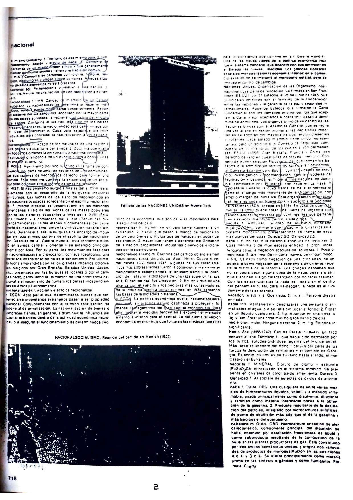
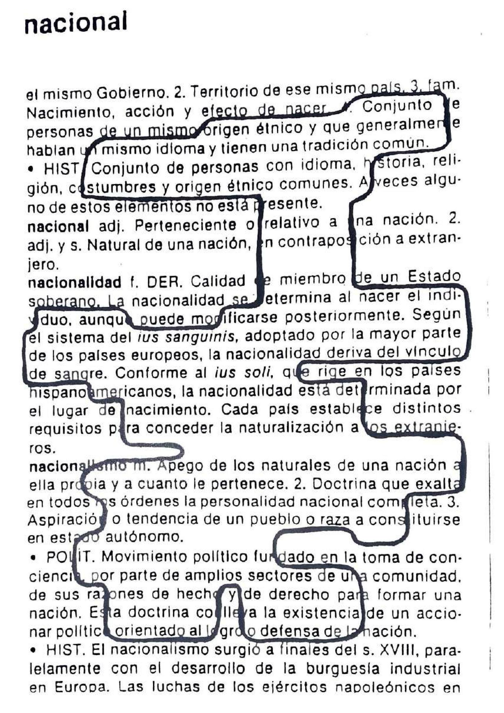
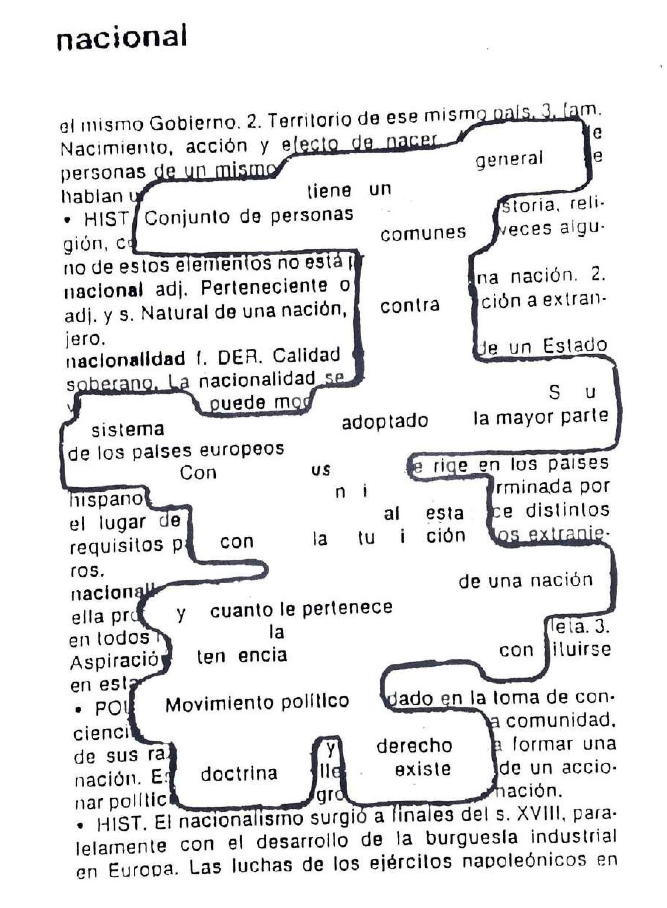
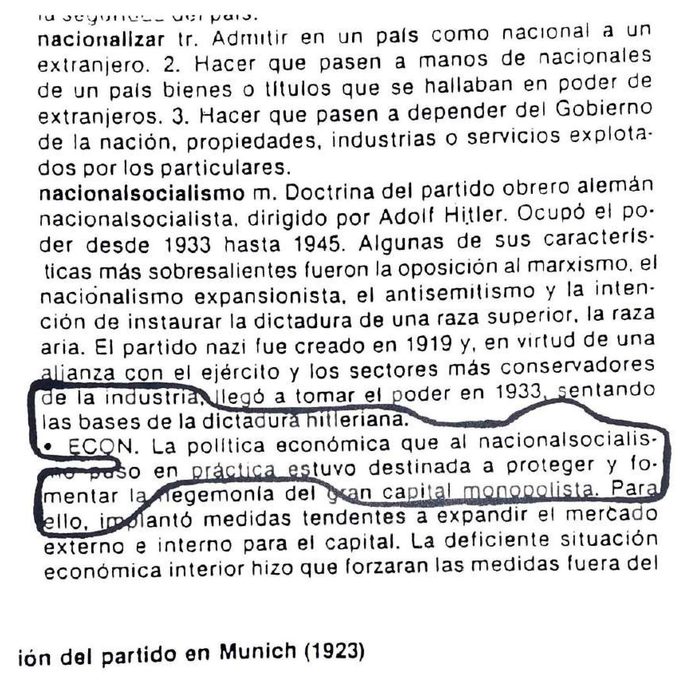
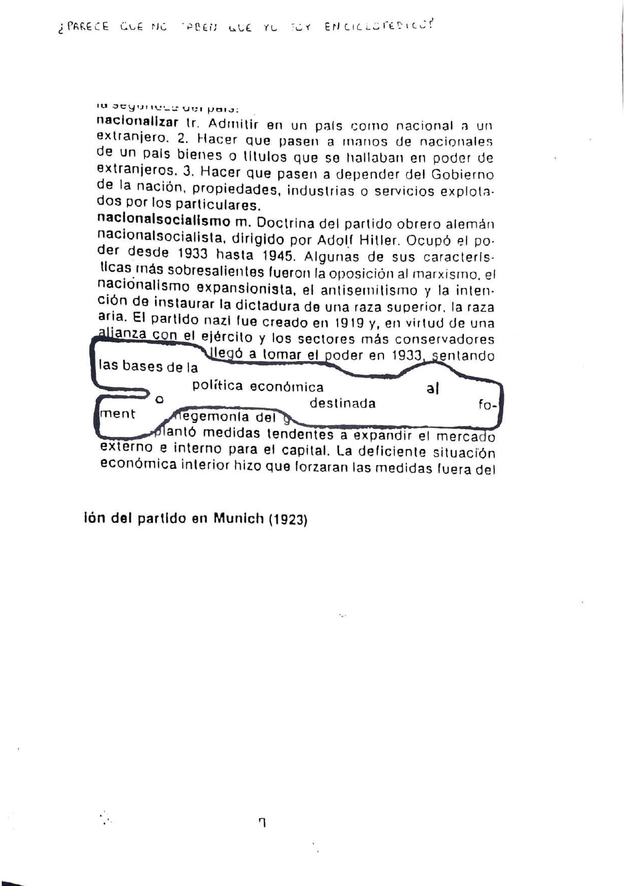
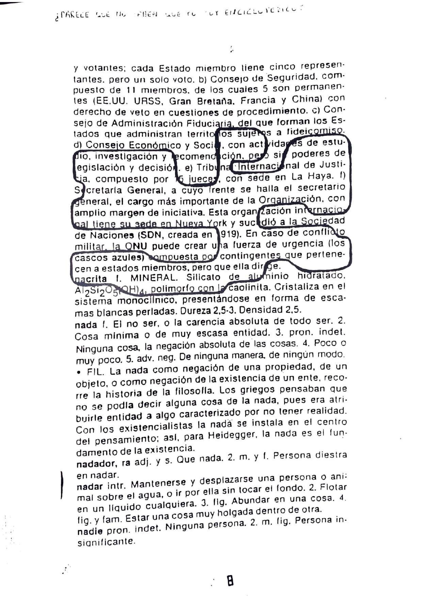
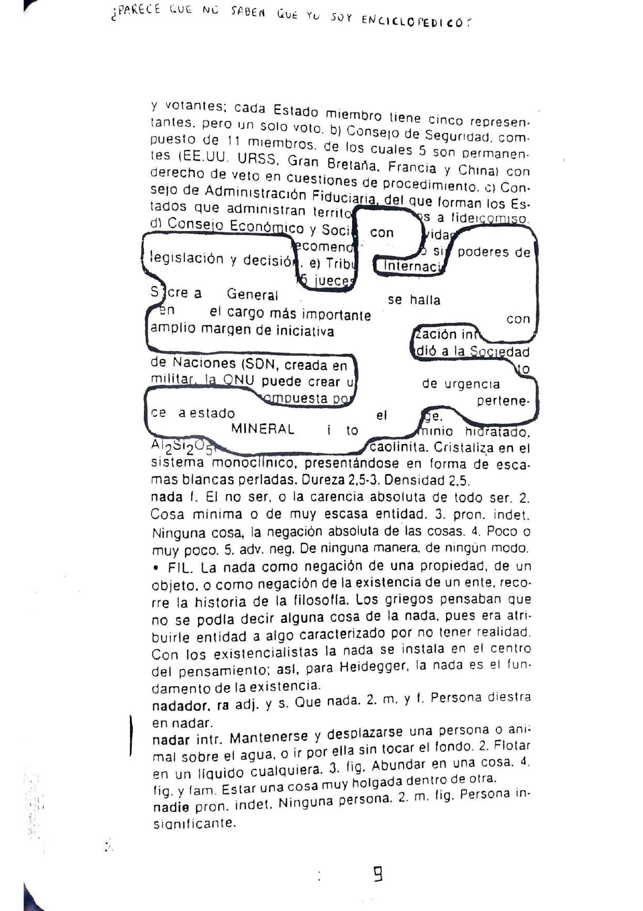

# ¿PARECE QUE NO SABEN QUE YO SOY ENCICLOPEDICO?

## ADVERTENCIA

Muchos sostienen que en la competitividad se cuenta con las llaves del éxito
internacional cuando se da preferencia a ciertas industrias en cuanto a
desarrollo y promoción de exportaciones. Informan sobre los resultados de sus
investigaciones. Necesario para estar al nivel de los competidores extranjeros
con mejor paga. Para encontrar las respuesta debemos concentrar la atención no
en el conjunto de la economía sino en la enciclopedia. Aun cuando las
exportaciones italianas hayan experimentado un aumento solo superado por las
japonesas. Hacen falta grandes conocimientos los que constituyen la espina
dorsal de las economías de Occidente. La historia política y social influye en
la destreza que se va acumulando en humanos más decisivos en al competencia
internacional. Por ejemplo llegan a niveles complejos de especialización y nunca
consultan la enciclopedita. Se crean presiones que sostienen e incrementan la
ventaja competitiva. Desempeñan un papel mucho más importante que los mecanismos
electorales o legislativos en la salvaguardia de los valores apreciados por las
sociedades democráticas. ¿Parece que no saben que los españolcios son
misteriosillos? Comprenden tanto las perspectivas politicas como las libertades
civiles. Facilitan las herramientas para el libre debate y la movilización.
Constituyen la esperanza de los oprimidos y se convierten en los aliados
naturales de todos los pueblos.

 
 
 
 

#### ¿PARECE QUE NO SABEN QUE YO NO SOY TAN ESTUPIDA?

<!-- laterla_2 --> Con esta conciencia debemos considerar las perspectivas. La
experiencia de las mujeres sostiene la autora brinda nuevas formas de entender
conceptos como el poder la comunidad y la participación. Durante siglos mientras
los hombres dirigían gobiernos y escribían sobre filosofía política. Desde sus
orígenes en la Grecia antigua hasta las obres de filósofos de los Siglos XVIII y
XIX como James Madison y John Stuart Mill. El Filósofo alemán Jürgen Habermas al
referirse a los espacios públicos y la características de la "condición de
expresión" ideal alentó a muchos a preguntarse cuáles son las instituciones y
estructuras de poder más propicias para el debate público.

#### ¿PARECE QUE NO SABEN QUE YO ME VOY A HACER PODEROSITO?

A esta alturas se ha llegado al punto de exponerse a la censura de la prense.
¿Los periodistas no saben que españoles son misteriosillos? Significa que todas
las políticas dirigentes e instituciones deben tenerse por deficientes. El éxito
político se basa en establecer haciendo críticos neutrales idear soluciones.

#### ¿PARECE QUE NO SABEN QUE YO NO PUEDO SER COMUNISTO SI SOY ENCICLOPEDICO?

Los logros de la ciencia la medicina y la exploración espacial los de las artes
creattivas las maravillas de la tecnología el mejoramiento de la condición
humana la firma de tratados de paz. De todos se ha informado. Recibimos mucha
información de políticos agencias gubernamentales grupos de interés y cosas por
el estilo. El hecho es que no tiene objeto discutir que existen otros medios de
comunación disponibles por los españoles. Se queda muy a gusto y en nuestra
rebuscada sociedad no solo no podría prescindir de ello sino que ni les pasaría
por la cabeza intentarlo. Afirman no puede usted vivir como quiere tiene que
afrontar la vida como es. Consagran mayor atención a las cosas esperanzadoras
que acontence. El primer párrafo el denominado entradilla hace un enunciado
acerca de un acontecimiento o cuestión. Al ser un enunciado representa de manera
inevitable un punto de vista. Su afán de meterse en todo con intención de
noticiar su frecuente exactitud lo completo de lo que comunican su obstinación
en la realidad todo ello asegura su popularidad. El público entonces tomará los
hechos escuetos que reciba y hará su propio análisis. Permitiendo a la gente
recibir no sólo la versión oficial de los acontecimientos sino también los
puntos de vista discrepantes. Creen que los hechos por sí mismos sin explicación
resultan de ordinario sólo desconcertantes y por tanto tienen valor limitado
para formar opiniones y llegar a decisiones. Dedican su vida a investigar e
informar sobre los sucesos en el mundo. Aún andan en busca de la verdad. Son
escépticos anacrónicos narradores a quien el público puede creerles. Ofrecen la
información más verídica.

#### ANALISIS CRITICO DE FACSIMIL ELECTRO-QUIMICO DEL SIGNO "N" FACSI 8
