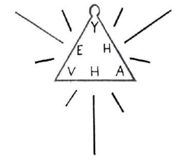

# RETRATO PSICOLÓGICO DE JUGADORES DEL EQUIPO CACIQUE: UN AÑO DESPUÉS

## HOMENAJE AL 500 ANIVERSARIO DEL DESCUBRIMIENTO DE AMÉRICA

### TESTIGOS

> “Sí, realmente esta persona escucha el pensamiento”.

Manuel Rodríguez Quinteros Comerciante Vega Central Stand 212.

> “Yo creo que José María sabe escuchar el pensamiento de los demás”.

Jośe Salomón Comerciante Portugal 48. Torre 6. Stand 1-B.

> “Sí, José María escucha mis pensamientos”.

Carolina Andrea Bustamante Comerciante Plaza de los Talleres. J.V. Lastarria 307

## ADVERTENCIA

En términos generales, se estima por la injerencia a raíz de los hechos. Hay
libertad de expresión en Chile. No pudieron entregar su bandera. No se puede
prejuzgar absolutamente la verdad. Área de Chile, se está cumpliendo. Sobre la
necesidad de superar este abismo que separa al mundo rico del mundo pobre que
culmine con sus sueños otrora juveniles, para que sean preocupación de todos.
Debieron enfrentarlo, es un boicot, una falta de respeto y una discriminación
increíble. Acapara el 69,9 por ciento de las preferencias. Encabezaba primero
cómputos; pero habría que considerar que hasta el día de hoy ha cumplido la
delicada Tarea de utilizar los medios de comunicación.

### ESPECULACIÓN

- [x] COBRELOA [ ] U. DE CHILE [x]

- [ ] COLO COLO [ ] O'HIGGINS [ ]

- [x] HUACHIPATO [ ] U. CATOLICA [ ]

- [ ] U. ESPAÑOLA [ ] LA SERENA [ ]

- [ ] FDEZ. VIAL [x] COBRESAL [x]

- [ ] TEMUCO [ ] EVERTON [x]

- [x] PALESTINO [x] ANTOFAGASTA [ ]

- [ ] COQUIMBO U. [ ] CONCEPCION [x]

- [x] MAGALLANES [ ] STA. CRUZ [ ]

- [ ] IBERIA [ ] A. ITALIANO [x]

- [x] ARICA [x] RANGERS [x]

- [x] OSORNO [ ] ATACAMA [x]

- [ ] COLCHAGUA [ ] LA CALERA [x]

<!-- vuelve a firmar, poner el titulo y subtitulo -->

1. RETRATO DE YÁÑEZ

   “¿Parece que los argentinitos comen alpiste? ¿Por eso que ellos son tan
   terribles? Lo único que saben es comer. Son como animales. Es cierto que
   juegan bien. ¿Son miserablitos? Quieren construir un castillo. Creen que los
   chilenos somos estúpidos. ¿Creen que los chilenos somos estúpidos porque nos
   tienen miedito? Ellos se mueven como Celentano %% mayusc P %% ¿por eso son
   temidos? Esos imbéciles son belicosos. Que se creen estos cara de ajo oye.
   ¿Ellos se creen que se van a quedar así? Son delincuentitos. Está
   demostradito que son miseria. Lo único que quieren es un platal. Lo único que
   quieren es tener status. ¿Por eso que son temidos? ¿Son temidos porque tienen
   estatura? Parece que son temidos porque hacen bien los pases. ¿Porque hacen
   pases más peligrosos por eso se creen extrafinos?”

2. RETRATO DE PIZARRO

   “Lo que pasa es que no saben na (sic) estos. Y así se creen tan pesaítos
   (sic). Nos hicieron pasar menso (sic) ni que susto. Estos lanzan (sic)
   puñaladas gritando. Estos son peor (sic) que los soviéticos. Estos son
   terribles Andaban por la cancha persiguiéndome con cuchillo. Esto parece que
   no tienen el espíritu del deporte. Lo único que saben es hacer cahuinitos.
   Parece que son del Sur. Parece que no saben ni leer los hijuna (sic). Son
   terrible de chuecos. ¿Es preferible no decir nada de ésto? Desprestigian al
   fútbol. Escuché sonidos tristes. Son sonidos que me penan. ¿El fútbol está en
   deuda?”

3. RETRATO DE MARTÍNEZ

   “Quiero hacer un cahuinito. Pareece que me estoy haciendo pichí. Ya descubrí
   que parezco sicópata. ¿Me voy a tener que meter con un hombre? Me voy a tener
   que meter con un pide-cigarros. ¿Estos parece que están calientes conmigo?
   ¿Me voy a a tener que meter con marihuana? Voy a tener que exigir que no me
   Falten el respeto. No me voy a meter con maricones porque son demonios. Voy a
   tener que ser solamente mujer. ¿Voy a tener que ponerme vestidos yo? ¿Parece
   que es verdad que parezco niña bonita? Me voy a tener que sacar este bigote
   asqueroso. Voy a tener que cuidarme porque yo no soy muy antiguo. ¿No será
   que los pide-cigarros son sidosos? Tú no parece mujer ¿a dónde la viste? Me
   voy a tener que suicidar. Me afeito al tiro los bigotes? ¿Voy a parecer
   mi'jita? Me voy a tener que vestir con taco alto. Voy a tener que ser fina
   como señora”.

4. RETRATO DE MORÓN

   “¿Por qué tuvo que ser así? ¿Porque el fútbol está degenerao (sic)? ¿No será
   que ellos no son estilistas? Yo me voy a ir con los argentinos. Ellos tienen
   su estilo oye. Ellos tienen su estilo a dónde la viste. ¿O me voy pa (sic)
   Estaos Uníos (sic) yo? Fueron igual que en la guerra. Porque tenían mucha
   plata. Ellos no querían perder en su casa. Parece que soy bien jetoncito oye.
   Ellos no querían perder en su casa (sic). Ellos se tenían que comer el buey.
   No se comieron el buey porque ellos son hombres. Claro que yo soy bien
   jetoncito oye. Si ellos se comían el buey comieron alpiste. ¿Significa que no
   soy un hombre yo? No soy muy hombre por eso que estoy en crisis. ¿No soy muy
   hombre yo porque comí alpiste? No soy muy hombre (sic) tú a dónde la viste.
   Los argentinos son diferentes. ¿Los argentinos jugaron como señores? Los
   argentinos nunca han comido alpiste. Yo me tengo que ir a otro país soy muy
   ignorante. Porque soy un pelota. No me quiero quedar aquí. ¿Significa que los
   argentinos son grandes? Los argentinos son como los niños. Nosotros somos
   miserables. ¿Los argentinos piensan que nosotros somos unos miserables?”

5. RETRATO DE VILCHES

   “Los argentino son asesinos. Para impresionarnos hicieron escándalo. Son como
   aristócratas con nosotros los chilenos. ¿Parece que no saben que nosotros
   somos sufriditos? Donde nos encuentramos nos sacamos la chucha y media.
   ¿Ellos creen que los chilenos somos miserables? ¿Por eso que siempre nos
   pifian estos güeones (sic)? ¿Por eso me están molestando a mí? ¿No seŕa que
   son comejenes? Parece que estos no son tan antiguos. Ellos no querían que
   fuésemos campeones por eso que están calientes. La jugamos por Chile. ¿Que no
   saben que los chilenos somos guapos? Los chilenos tenemos cualquier (sic)
   estilo. Nosotros nunca dejamos la cagá (sic) aquí. Los argentinos son
   delincuentes. Los argentinos son imbéciles. Son energúmenos”.

6. RETRATO DE MARGAS

   “Parece que no existo. Yo soy como el Temucano. Por eso que no tengo luz.
   Estoy muerto porque estoy en la obscuridad. Debe ser porque no estudié. ¿Mis
   compañeros también saben que yo no existo? ¿No será que yo soy un sicópata?
   Por eso que no soy como un señor. Parece que yo estoy así porque no soy muy
   antiguo. Será mejor que me medicine. Si me medicino yo me pongo un 7. ¿Parece
   que tengo que conversar con un psicólogo? Parece que yo soy alto. Parece que
   vos soi (sic) como Marijuana y Sifo a dónde la viste. Por eso que es mejor
   que no me vaya de Chile. Si estai (sic) en crisis te quedai (sic) en Chile ¿a
   dónde la viste?”
